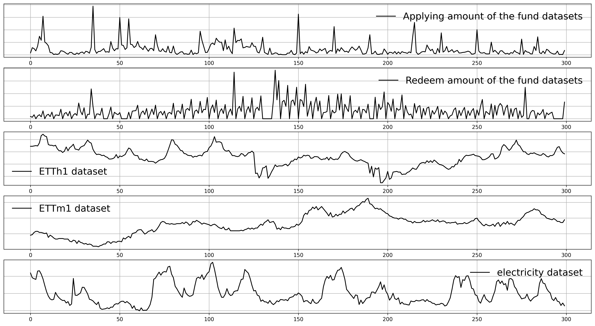

# MLF
Our experimental environments involve Pytorch 1.12.1 and Numpy 1.22.4.
## Downloading Datasets
  You can download the public datasets and Fund dataset used in our paper from https://drive.google.com/drive/folders/1IecxNQqH6hYEgaZT70t273BFHV-WeIw1?usp=sharing. The downloaded folders e.g., "Fund_Dataset",  should be placed at the "dataset" folder. 
  
## Reproducing Paper Results
We have provided the experimental run scripts for MLF and baseline models (PatchTST, Pathformer, Scaleformer, NHits and FiLM) on both the Fund dataset and the public datasets. The corresponding model names and forecasting tasks are included in the script names. 
The hyperparameters used for experiments of different methods have been set in their respective scripts to reproduce the experimental results of the paper.
  
## Introduction of Fund Sales Dataset
We collect fund sales datasets of different customers from Ant Fortune, which is an online wealth management platform on the Alipay APP. A subset of the 66 fund datasets covering January 2021 to January 2023 is currently released due to confidentiality reasons. The variable and description of each fund product are as follows: 

| Variable       | Description                                                                                                                                                                                                                                           |
|----------------|-------------------------------------------------------------------------------------------------------------------------------------------------------------------------------------------------------------------------------------------------------|
| is_summarydate | indicates whether the transaction date of the current fund product is a summary date (fund products do not trade on holidays and weekends, and the trading volume during these periods is aggregated to the next non-holiday or non-weekend, known as a summary date) |
| apply_amt| represents the applying transaction amount of the current fund product                                                                                                                                                                                   |
| redeem_amt       | represents the redemption transaction amount of the current fund product                                                                                                                                                                                   |
| during_days       | indicates the holding period of the current fund product (the number of days to hold the fund product before it can be traded)                                                                                                                                                                                   |
| is_trade       | indicates whether the current day is a trading day                                                                                                                                                                                                    |
| is_weekend_delay       | indicates whether it is a weekend before a trading day                                                                                                                                                                                                |
| holiday_num      | indicates how many statutory holidays occur before the trading day                                                                                                                                                                                    |

Time series visualization of Fund dataset (first two lines) and public datasets is shown as follows:

