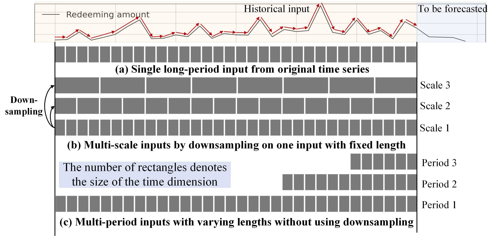
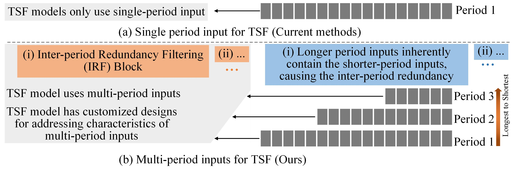
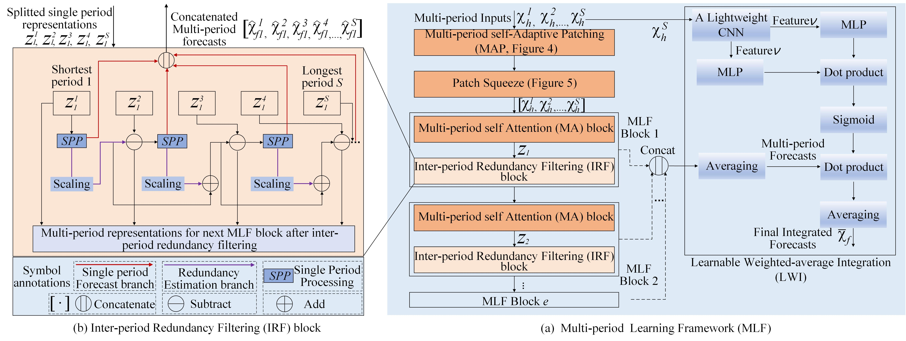
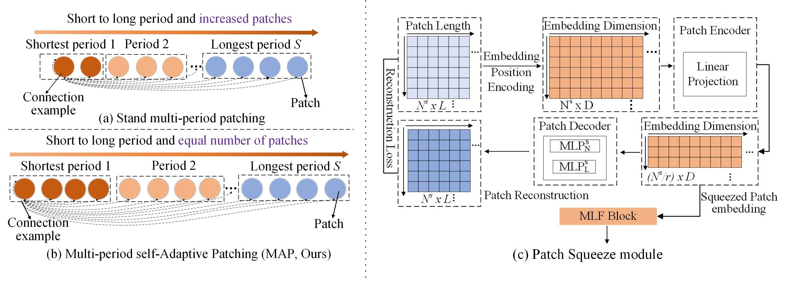

## Multi-period Learning for Financial Time Series Forecasting (MLF, KDD2025)

###### Simple introduction

This is code for Multi-period Learning for Financial Time Series Forecasting (MLF, published in KDD 2025), which incorporates multiple inputs with varying lengths (periods) to achieve better accuracy and reduces the costs of selecting input lengths during training.

In our work, multi-period inputs refer to multiple original time series windows with varying input lengths, as shown in follwoing sub-figure (c). This is different from the multi-scale inputs in Pyraformer and Scaleformer, which are obtained by downsampling from the same fixed input length (follwoing sub-figure (b)).

Different input lengths have a significant impact on prediction accuracy. However, selecting appropriate input lengths is a crucial challenge affecting time series forecasting.  we propose MLF to extract the semantic information of short-medium-long-term individually using sequences with varying lengths, to avoid model fails to learn the different semantics under only long-term inputs, e.g., the prediction error of Pathformer and Scaleformer using long-term sequence inputs is higher than that of short-term one. 

It's not easy to use inputs of different lengths simultaneously for prediction due to challenges caused by multi-period characteristics. As shown in the following figure, MLF is a benchmark that exlpores an architecture consists of various componments to address the challenges to incorporate multiple inputs with varying lengths to achieve better accuracy.

## Overall architecture
The overall architecture of MLF is shown in following figure.

The two simple but effective componments of MLF are shown in following figure. For instance, the Patch Squeeze module significantly improves efficiency
while maintaining good accuracy in the long-term TSF task.

## Downloading Datasets
  You can download the public datasets and Fund dataset used in our paper from https://drive.google.com/drive/folders/1IecxNQqH6hYEgaZT70t273BFHV-WeIw1?usp=sharing. The downloaded folders e.g., "Fund_Dataset",  should be placed at the "dataset" folder. Due to confidentiality reasons, we can only disclose partial data of fund products. The average holding period of Fund 1, Fund 2, and Fund 3 gradually increases, and the overall time pattern distribution also changes, which can be used for a more comprehensive evaluation of the algorithm's effectiveness. 

## Introduction of Fund Sales Dataset
We collect fund sales datasets of different customers from Ant Fortune, which is an online wealth management platform on the Alipay APP. A subset of fund datasets covering January 2021 to January 2023 is currently released due to confidentiality reasons. The variable and description of each fund product are as follows: 

| Variable       | Description                                                                                                                                                                                                                                           |
|----------------|-------------------------------------------------------------------------------------------------------------------------------------------------------------------------------------------------------------------------------------------------------|
| is_summarydate | indicates whether the transaction date of the current fund product is a summary date (fund products do not trade on holidays and weekends, and the trading volume during these periods is aggregated to the next non-holiday or non-weekend, known as a summary date) |
| apply_amt| represents the applying transaction amount of the current fund product                                                                                                                                                                                   |
| redeem_amt       | represents the redemption transaction amount of the current fund product                                                                                                                                                                                   |
| during_days       | indicates the holding period of the current fund product (the number of days to hold the fund product before it can be traded)                                                                                                                                                                                   |
| is_trade       | indicates whether the current day is a trading day                                                                                                                                                                                                    |
| is_weekend_delay       | indicates whether it is a weekend before a trading day                                                                                                                                                                                                |
| holiday_num      | indicates how many statutory holidays occur before the trading day                                                                                                                                                                                    |

Time series visualization of Fund dataset (first two lines) and public datasets is shown as follows:

